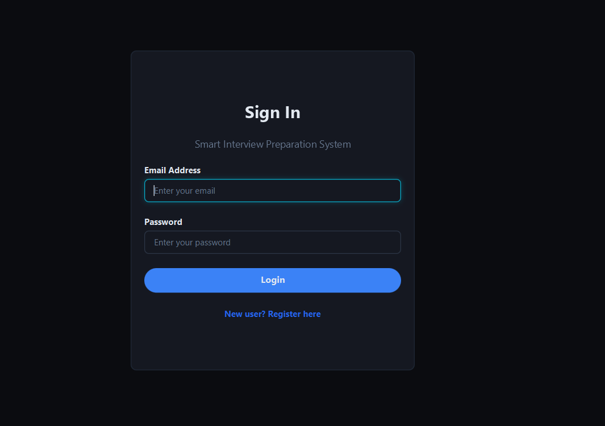
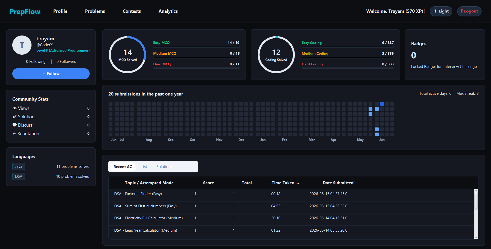
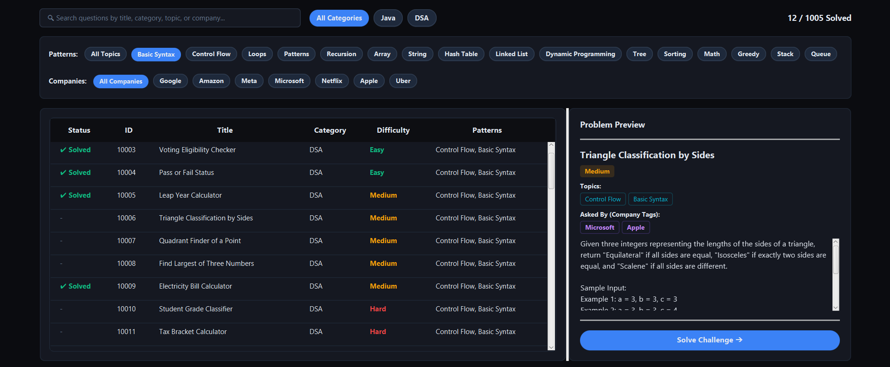
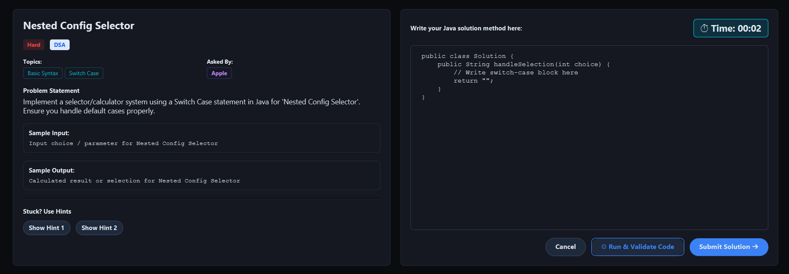
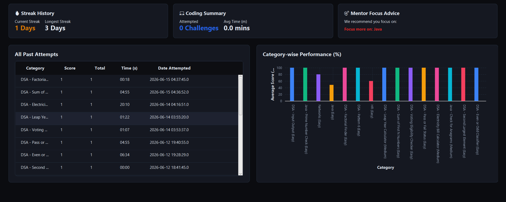

# PrepFlow — Modern Full-Stack Coding & Interview Prep Platform

PrepFlow is a modern web application designed for software developers to practice coding challenges, take mock interviews, and track progress with interactive analytics.

---

## Key Features
*   **Coding Playground**: Dual-pane workspace with a syntax-highlighted coding editor and sample input/output test cases.
*   **Streak Tracker**: GitHub-style activity contribution grid logging user progress and streak records.
*   **Mock Interviews**: Integrated assessment simulator with real-time scoring and history.
*   **Performance Analytics**: Dynamic dashboard showing statistics categorized by difficulty and topic.
*   **Authentication & Themes**: Secure user authentication with responsive light and dark mode toggles.

## Tech Stack
*   **Frontend**: React (TypeScript, Vite, Context API, CSS Grid/Flexbox)
*   **Backend**: Node.js, Express, TypeScript, Prisma ORM, JWT Authentication
*   **Database**: PostgreSQL

## Quick Start

### 1. Backend Setup
```bash
cd backend
npm install
# Create a .env file using .env.example values
npx prisma migrate dev --name init
npx prisma db seed
npm run dev
```

### 2. Frontend Setup
```bash
cd frontend
npm install
npm run dev
```

---

## Screenshots

### 1. User Authentication & Login


### 2. Developer Dashboard & Streak Grid


### 3. Problems Directory & Live Preview


### 4. Interactive Coding Workspace


### 5. Progress Analytics & Performance Metrics


---

## License
This project is licensed under the MIT License.
